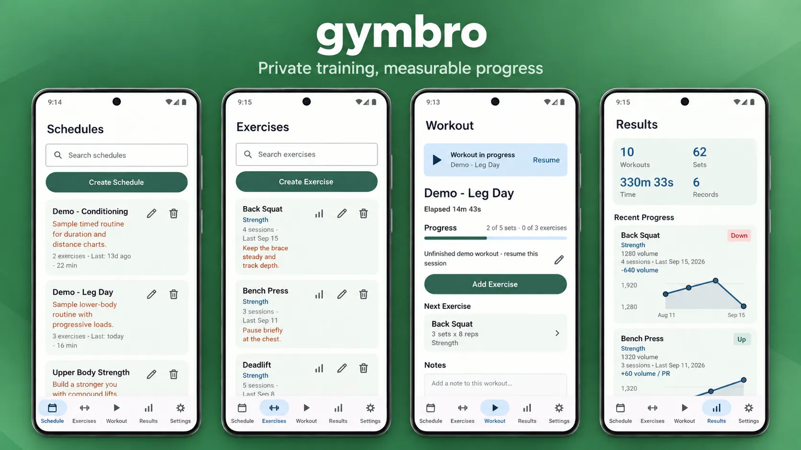

## What is it?

Gymbro is a private, local-only Android workout tracker. Your data stays on your device while you track trends, personal records, and measurable progress across every exercise.

## Features

- Create and edit exercises and schedules.
- Select multiple exercises while building a schedule and keep their order.
- Resume an unfinished workout after closing the app.
- Log reps, weight, duration, distance, completion, and notes.
- Review per-exercise trends, personal records, session comparisons, and charts.
- Export and import scoped JSON backup files

All workout data stays on the device. There is no account, network sync, or analytics service.

## Installation

### From F-Droid

Not available on F-Droid yet, but it will be soon.

### Manually

You can download the latest apk from the [releases](https://github.com/brokenpip3/gymbro/releases/latest) page.

## Contributing

If you want to poke around the internals or build it yourself, the entire development environment is done via nix devshells. You can build the debug apk with: `just build-debug`.

## Credits

Gymbro was inspired by [GymRoutines](https://codeberg.org/noahjutz/GymRoutines), while focusing on statistics and trends.
